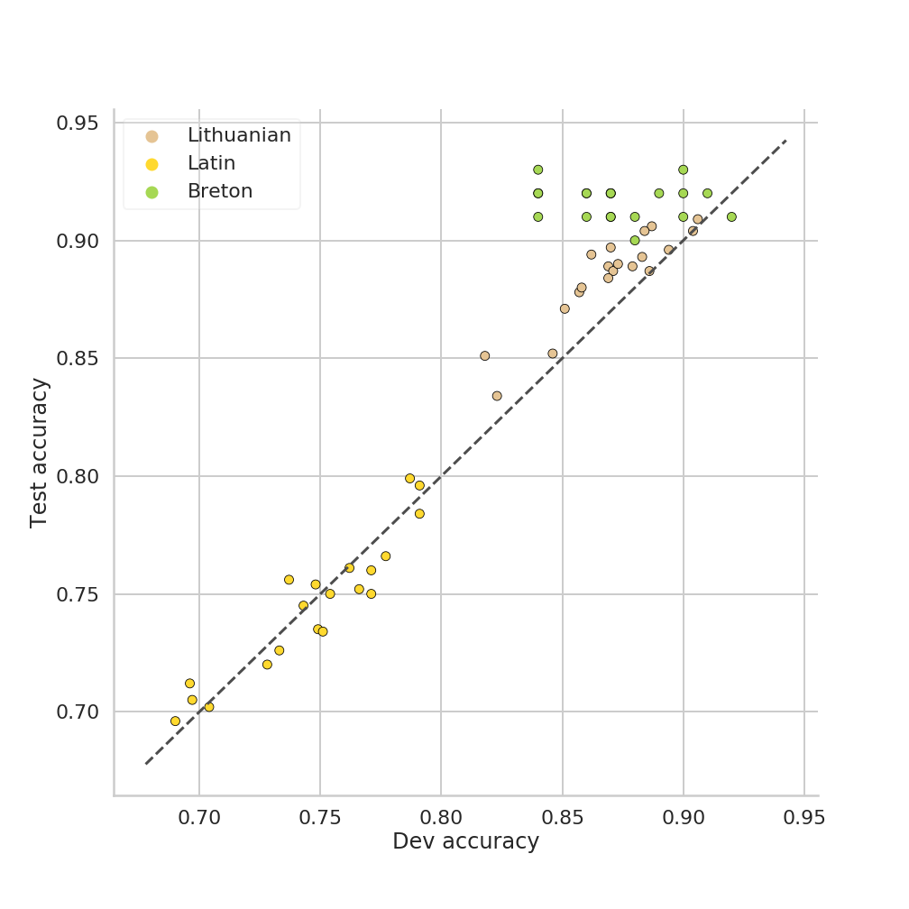
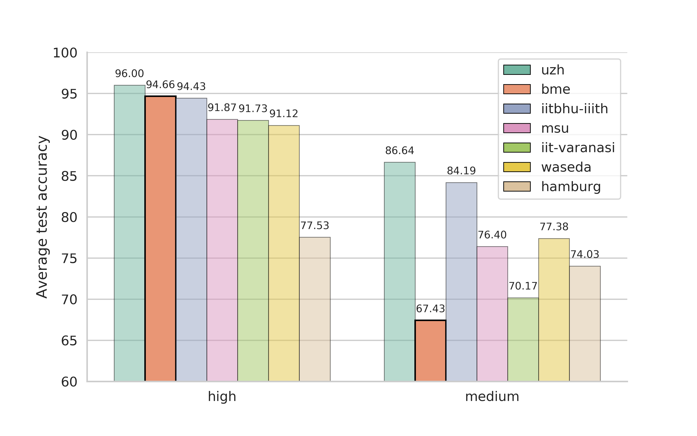
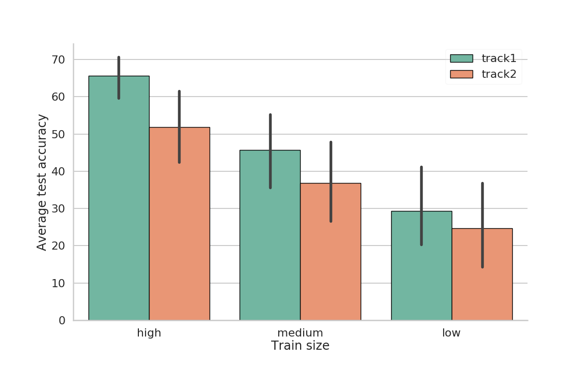

# sigmorphon2018

BME-HAS submission for the [CoNLL–SIGMORPHON 2018 Shared Task: Universal Morphological Reinflection](https://sigmorphon.github.io/sharedtasks/2018/) 

This repository contains the following:

1. configuration files: see below
2. shell scripts: used for running a large number of experiments. They are not
   heavily tested and may contain custom paths that will not work for you.
3. analysis notebooks: jupyter notebooks for data and result analysis
4. `create_submissions.ipynb`: a single notebook that we used to create and
   pack submissions. Sanity checks are included in this notebook.

The actual models are implemented as part of a larger framework, available
[here](https://github.com/juditacs/deep-morphology). The framework is under
constant development but you can always checkout the exact commits that were
used during the shared task.

# Requirements

- Linux: All experiments were run on Debian 3.16. They may work on other systems, but we
have not tested them.
- Python 3.6: We used Pyhton3.6 with Miniconda.
- UTF-8 locale: the dataset is encoded using UTF-8 too.
- deep-morphology

The framework deep-morphology needs to be installed as a Python package.

    git clone https://github.com/juditacs/deep-morphology.git
    cd deep-morphology
    pip install -e .

# General information

Each experiment is configured by a single YAML configuration file and optional
command line arguments that may override the configuration file. In practice,
we usually only specify the train and the dev file as command line arguments
and load every other option from the config file. If you just want to replicate
our results, you do not need to specify the training and dev files (see below).

# Task1

As explained in the [paper](https://aclanthology.org/K18-3016/), we trained a large number of random
experiments on three languages, chose the 5 best configuration by language,
then we ran the 15 configs on every language and every data size. These
configurations are available in the
[config/task1/two_headed/best_configs/](https://github.com/juditacs/sigmorphon2018/tree/master/config/task1/two_headed/best_configs)
directory. The best configuration (by dev word accuracy) for each language and
training size are saved in the
[config/task1/highest_dev_acc](https://github.com/juditacs/sigmorphon2018/tree/master/config/task1/highest_dev_acc)
directory. We provide a script that trains a replicate experiment:

    python train_replica.py -c config/task1/highest_dev_acc/adyghe_high.yaml -e exps/replica/task1

This script requires deep morphology to be installed. It also assumes that you
have the dataset checked out into a directory called `data`. You can do this
by:

    cd <path to this repo>
    mkdir -p data
    cd datahttps://aclanthology.org/K18-3016/
    git clone https://github.com/sigmorphon/conll2018

# Task2

The model for Task2 has been deprecated and removed from the newer versions of
deep-morphology. The reason we're not porting them to the newer version is that
these models are very specific to the task at hand.
You can checkout an older commit by running:

    git checkout <commit hash>

Look up the exact commit hash in the configuration file.

Task2 best configurations are in the
[config/task2/track1/highest_dev_acc](https://github.com/juditacs/sigmorphon2018/tree/master/config/task2/track1/highest_dev_acc)
[config/task2/track2/highest_dev_acc](https://github.com/juditacs/sigmorphon2018/tree/master/config/task2/track2/highest_dev_acc)
directories.

For example you can replicate the French low setting for Track1 by running:

    python train_replica.py -c config/task2/track1/highest_dev_acc/fr_low.yaml -e exps/replica/task2/track1

Note that these experiments take much longer than the ones for Task1. High data
settings toook up to 5-10 hours on a 12GB NVIDIA GTX TITAN.

# Note on reproducability

Please note that the results of experiments slightly vary accross machines and
GPUs as well as versions of PyTorch and deep-morphology, thus replicating the
exact results is very difficult. However the differences are almost negligible
and you should see similar numbers to the ones reported in the paper.

# Misc

I made a few figures after publishing the paper, here they are.

## The effect of random initialization

Three languages were used for random parameter search for Task 1. Here we
trained the best configuration for each language 20 times with different random
seeds which seems to affect the dev and test accuracy quite heavily.

## Task1 results on a bar chart

The results of high and medium tracks of the 7 highest performing teams (on
the high setting).

## Our Task2 results

